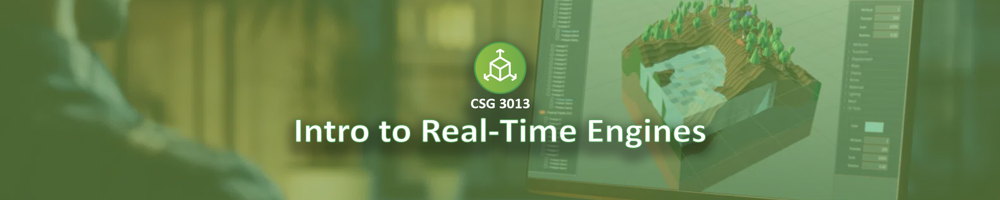

## CSG 3013 Intro to Real-Time Engines
Real-time engines are utilized to create immersive and interactive virtual worlds, games, special effects, simulations, animations and various other applications. Students will learn through hands-on experimentation and analysis, the fundamental components, features, and logical frameworks of popular real-time engines, applying scientific principles to problem-solving and content creation. Students will also develop skills in visual logic design to prototype and refine designs. Emphasis is placed on grounding development practices in sound scientific and ethical principles, ensuring solutions meet both professional and societal standards.

*QUAD IV: This course fulfills the Quad IV applied science requirement.*